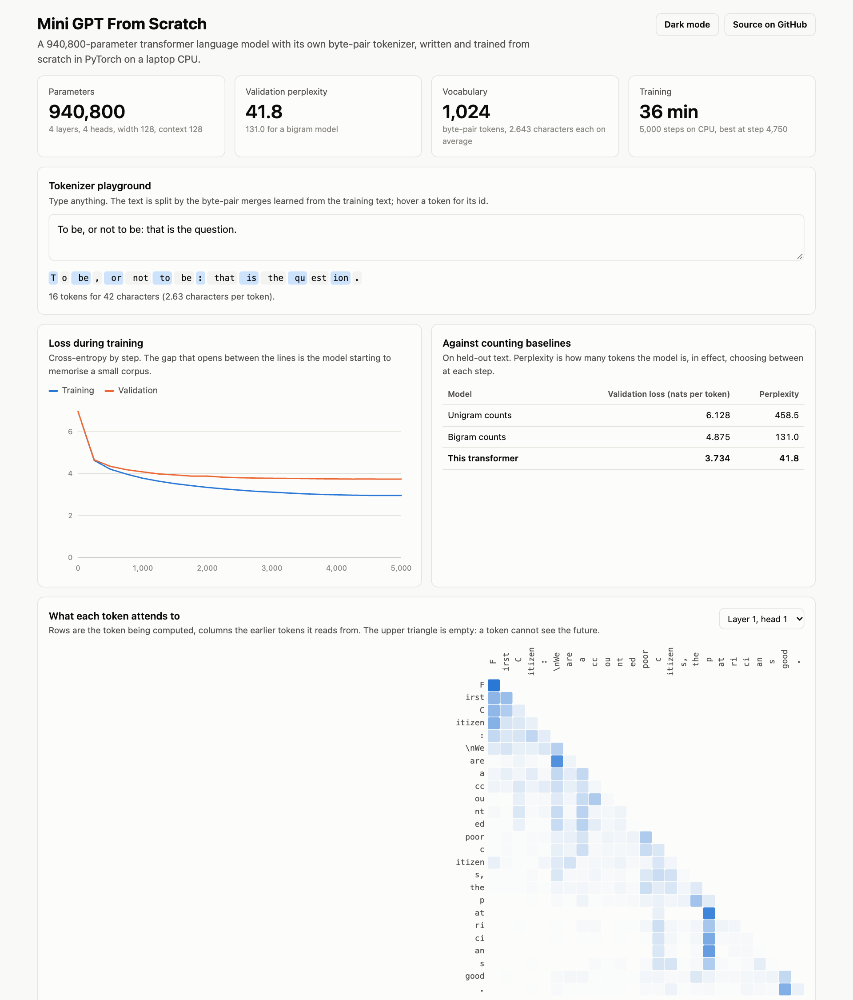

# Mini GPT From Scratch


A small GPT written from scratch in PyTorch: a byte-pair tokenizer, causal multi-head self-attention, the training loop, and temperature, top-k and top-p sampling. Nothing is imported from a transformer library; the point is to show how each piece works.

**Live demo:** https://s-harshni.github.io/Mini-GPT-From-Scratch/ (tokenizer playground, attention maps, loss curve, samples)



## What is in it

| Piece | File | What it does |
| --- | --- | --- |
| Tokenizer | [`tokenizer.py`](src/minigpt/tokenizer.py) | Byte-pair encoding trained from scratch: starts from bytes and merges the most frequent adjacent pair until the vocabulary has 1,024 tokens. Any Unicode text round-trips exactly. |
| Model | [`model.py`](src/minigpt/model.py) | Decoder-only transformer: token and position embeddings, pre-norm residual blocks, hand-written causal multi-head self-attention, an MLP, and an output layer that shares weights with the token embedding. |
| Training | [`train.py`](train.py) | Next-token cross-entropy, AdamW with weight decay on matrices only, linear warm-up then cosine decay, gradient clipping, evaluation on held-out text, best checkpoint kept. |
| Sampling | `filter_logits`, `generate` in [`model.py`](src/minigpt/model.py) | Greedy, temperature, top-k and top-p (nucleus) decoding with a sliding context window. |

## Results

Trained on Tiny Shakespeare (1,115,394 characters, 422,094 tokens; the last 10% held out) for 5,000 steps on a laptop CPU.

| Model | Validation loss (nats per token) | Perplexity |
| --- | ---: | ---: |
| Unigram counts | 6.128 | 458.5 |
| Bigram counts | 4.875 | 131.0 |
| **This transformer (940,800 parameters)** | **3.734** | **41.8** |

- **Configuration:** 4 layers, 4 heads, width 128, 128-token context window, vocabulary 1,024.
- **Tokenizer:** 2.64 characters per token on this text.
- **Overfitting is visible and reported:** training loss reaches 2.95 while validation stops near 3.73. The corpus is small, so a bigger model would only memorise it faster.

### What the sampling settings do

The same prompt, five samples per setting. Distinct-2 is the share of adjacent token pairs that are not repeats.

| Setting | Distinct-2 | Behaviour |
| --- | ---: | --- |
| Greedy (temperature 0) | 0.38 | Deterministic and repetitive |
| Temperature 0.5 | 0.82 | Fluent, conservative |
| Temperature 0.8, top-p 0.9 | 0.94 | Varied, mostly coherent |
| Temperature 1.0 | 0.98 | More invented words |
| Temperature 1.5 | 0.99 | Spelling starts to break down |

### What each part buys (ablations)

Five variants trained with the same data, seed and budget (1,500 steps each, so the numbers are higher than the 5,000-step run above). [`ablate.py`](ablate.py) reproduces the table.

| Variant | Parameters | Validation loss | Perplexity |
| --- | ---: | ---: | ---: |
| **Full model (4 layers, 4 heads)** | 940,800 | 4.022 | 55.8 |
| No position embeddings | 940,800 | 4.154 | 63.7 |
| One attention head | 940,800 | 4.014 | 55.4 |
| One layer | 345,984 | 4.062 | 58.1 |
| Context of 16 tokens | 926,464 | 4.428 | 83.8 |

- **Context matters most.** Cutting the window from 128 to 16 tokens raises perplexity from 55.8 to 83.8: the model needs to see who is speaking and what was said.
- **Position embeddings matter.** Without them attention cannot tell word order, and perplexity rises to 63.7.
- **More heads did not help at this size.** One head scores 55.4 against 55.8 for four. With a width of 128, four heads of 32 dimensions each are no better than one of 128; the difference is within what a second seed would move.
- **Depth helps a little.** One layer with a third of the parameters reaches 58.1, so most of the gain over a bigram model comes from the first attention layer.

## Tests

10 tests, run in CI:

- The tokenizer round-trips arbitrary text (including non-Latin scripts), is deterministic, and saves and loads.
- The hand-written attention matches PyTorch's `scaled_dot_product_attention`, its weights sum to 1, and nothing attends to the future.
- Changing later tokens does not change earlier logits (causality).
- The initial loss equals ln(vocabulary size), and the model can memorise one batch.
- Top-k and top-p keep exactly the right tokens, in any vocabulary order.
- Generation is reproducible with a seed and works past the context window.
- Without position embeddings the model cannot tell word order apart; with them it can.

## Run it

```bash
python -m venv .venv && source .venv/bin/activate
pip install -r requirements.txt
python train.py                     # trains tokenizer and model, writes docs/data.json (30 to 40 minutes on CPU)
python ablate.py                    # five ablation runs, writes results/ablations.json
pytest -q
python -m http.server -d docs 8000  # demo at http://localhost:8000
```

## Limitations

- About one million parameters and one megabyte of text: it learns the form of the plays (speaker names, line lengths, common words), not meaning.
- Trained on CPU with one seed; no hyperparameter search. The ablations also use one seed each, so differences of a point of perplexity are not meaningful.
- The tokenizer is trained on the same small corpus, so text unlike Shakespeare falls back to bytes.

## Data

Tiny Shakespeare, a public-domain excerpt of Shakespeare's plays collected by Andrej Karpathy for char-rnn.

## Author

[S Harshni](https://github.com/S-Harshni)
